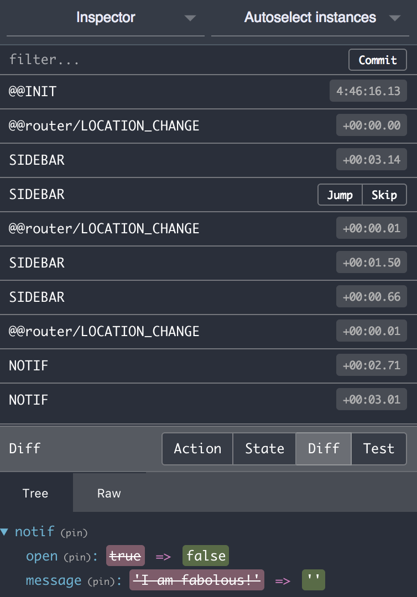

----------------------------------------------
Yet Another React Boilerplate with Material-UI
----------------------------------------------

.. image:: https://travis-ci.org/fmakdemir/react-boilerplate.svg?branch=master
    :target: https://travis-ci.org/fmakdemir/react-boilerplate

Introduction
############

This is a boilerplate to make it easier developing websites using
React with hot-realoading and redux monitoring on webpack 2 and using
Material-UI components.

Example screenshots:

Features
########

- React boilerplate with ES6 JSX support.
- Webpack_ 2.
- Webpack loaders included: css, less, json.
- Local styling enabled to prevent global css rules messing all style.
- Material-UI_
- Router with redux history synchronization.
- Redux DevTools enabled for monitoring.

Will be added
~~~~~~~~~~~~~
- Tests with mocha

Setup
#####

- Install latest node & npm versions depending on your system.
- To install project dependencies either:

  - Suggested:
    - install yarn globally with :code:`npm install yarn -g`
    - install project dependencies with :code:`yarn install`
  - or not suggested: :code:`npm install`

`yarn` ensures you are using packages the same with deployed and tested version.

Development
-----------

:code:`npm run dev` to run in test mode with hot reloading and a nice dashboard showing it's state.
:code:`npm run lint` to eslint code

Notes:

- All class selectors in style files will be replaced with path unique class names that
  can be accessed with imported variable. See :code:`pages/home.less` with and note that
  :code:`.home` is given to files with :code:`style.home` variable.
- If you really want global style with classes use :code:`:global(.my-global-class)` notation.

Useful extensions
~~~~~~~~~~~~~~~~~

- [Redux DevTools](https://github.com/zalmoxisus/redux-devtools-extension)
  Allows you to monitor changes in redux store.
- [React DevTools](https://chrome.google.com/webstore/detail/react-developer-tools/fmkadmapgofadopljbjfkapdkoienihi)
  For chrome allows you to inspect React components.

Example usage of Redux DevTools:

Production
----------

Static deployment: :code:`npm run build` will generate a :code:`dist` folder with all necessary files.

Serving over node: :code:`npm start` (does build itself no need to run build separately)

If you want to change the port modify start script or use
:code:`PORT=MY_PORT node server.prod.js` after build.

Project Structure
#################

- :code:`src`: holds source files for react. If you add react files outside of
  this folder you might need to tweak :code:`webpack.config.js`
- :code:`lib`: is for nodejs server libraries.
- :code:`conf`: is for general purpose server configurations like nginx.
- :code:`static`: is where all static files should be put. All these files will
  be copied to build folder (defaults to :code:`dist`). This includes :code:`index.html`
  served by node server. All these files can be accessed with urls like
  :code:`/img/icon-16x16.png`.

.. _material-ui: http://www.material-ui.com
.. _webpack: https://webpack.js.org/
